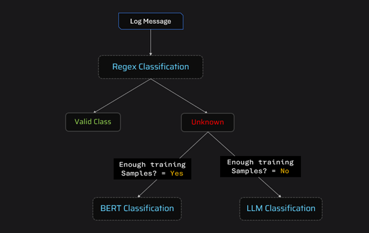

# **Log Classification With Hybrid Classification Framework**

This project implements a hybrid log classification system, combining three complementary approaches to handle varying levels of complexity in log patterns. The classification methods ensure flexibility and effectiveness in processing predictable, complex, and poorly-labeled data patterns.

## Classification Approaches

**1. Regular Expression (Regex):**
* Handles the most simplified and predictable patterns.
* Useful for patterns that are easily captured using predefine rules.

**2. Sentence Transformer + Logistic Regression:**
* Manages complex patterns when there is sufficient training data.
* Utilizes embeddings generated by Sentence Transformers and applies Logistic Regression as the classification layer.

**3. LLM (Large Language Models):**
* Used for handling complex patterns when sufficient labeled training data is not available.
* Provides a fallback or complementary approach to the other methods.

# Folder Structure

1.training/:
* Contains the code for training models using Sentence Transformer and Logistic Regression.
* Includes the code for regex-based classification.
2. models/:
* Stores the saved models, including Sentence Transformer embeddings and the Logistic Regression model.

3. resources/:

* This folder contains resource files such as test CSV files, output files, images, etc.

**4.  Root Directory:**
Contains the FastAPI server code (server.py).

# Usage

Upload a CSV file containing logs to the FastAPI endpoint for classification. Ensure the file has the following columns:

* source
* log_message

The output will be a CSV file with an additional column target_label, which represents the classified label for each log entry.
